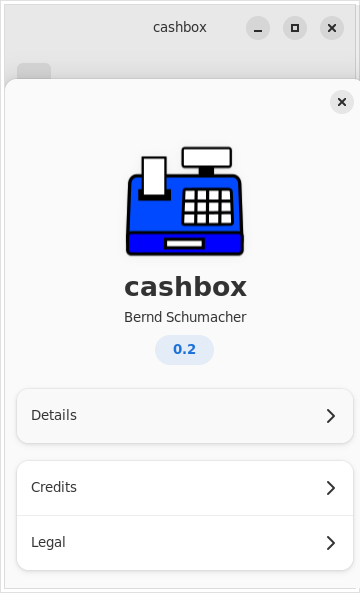
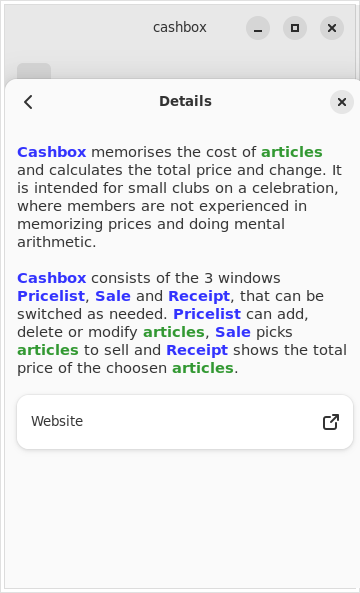
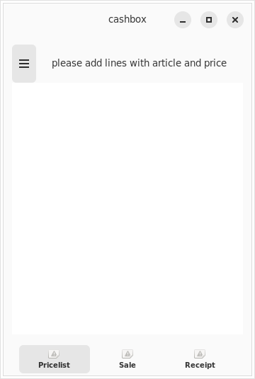
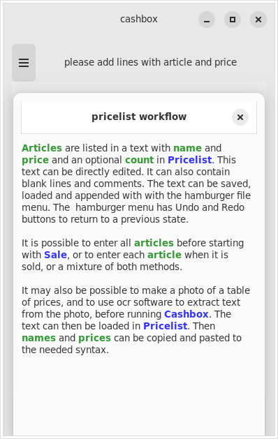
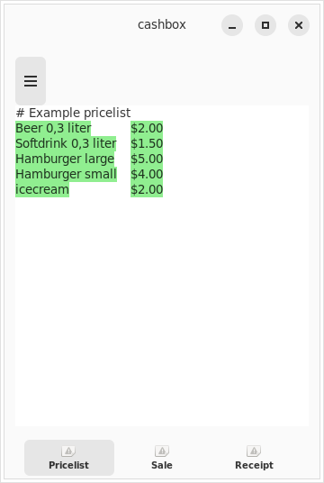
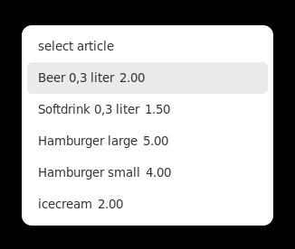
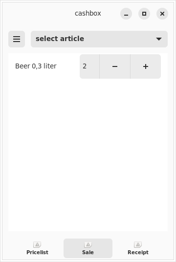
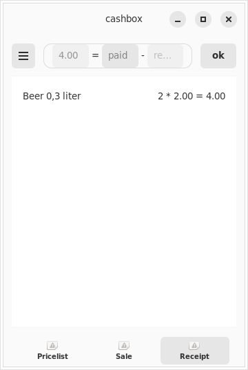
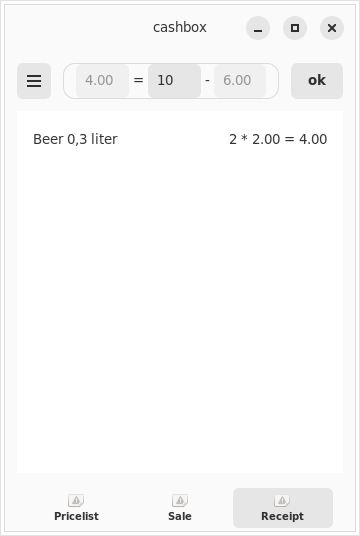

# cashbox - memorise cost and calculate price of articles
cashbox is a Gtk4 app tested on the librem5 with mobian.

cashbox memorises the cost of articles and calculates the total price and
change. It is intended for small clubs on a celebration, where members are
not experienced in memorizing prices and doing mental arithmetic.

## main windows
 * Pricelist - edit list of articles (name, price and optional count)
 * Sale - selects articles
 * Receipt - shows cost of selected articles
 
## work flow
1. optionally scan price-list with ocr software (outside of cashbox)

2. edit price-lsit with cashbox-Pricelist
 * empty lines in the price-list are ignored
 * comments starting with a '#' are ignored
 * each line represents one article
 * each line has the format: `<name> <price> [<count>]`
 * `<name>` can have spaces but must be unique.
 * `<price>` must be one ore more digits followed by a decimal separator and 2 decimal places
 * `<count>` must be one or more digits and is optional.

3. select, deselect or modify count of articles with cashbox-Sale

4. present cost of articles and calculate change

## testing cashbox version 0.2

Please download and install `cashbox_0.2_all.deb` or build it from source.
Debian verison crimson or debian/trixie is needed on librem5.
Steps below are shown as an example with user bs on host crimson.

 * install binary:

    bs@crimson:~$ wget https://salsa.debian.org/debian/cashbox/-/raw/main/bin/cashbox_0.2_all.deb
    bs@crimson:~$ wget https://salsa.debian.org/debian/cashbox/-/raw/main/bin/cashbox.md5sums
    bs@crimson:~$ md5sum -c cashbox.md5sums # expected: cashbox_0.2_all.deb: OK
    bs@crimson:~$ sudo dpkg -i cashbox_0.2_all.deb 
    # please fix dependency problems from install as shown in last step

 * build from source:

    bs@crimson:~$ sudo apt install git devscripts
    bs@crimson:~$ git clone https://salsa.debian.org/debian/cashbox.git
    bs@crimson:~$ cd cashbox
    bs@crimson:~/cashbox$ mk-build-deps ./src/debian/control
    bs@crimson:~/cashbox$ sudo dpkg -i cashbox-build-deps_0.2_all.deb 
    # please fix dependency problems from build as shown in next step now
    bs@crimson:~/cashbox$ make
    bs@crimson:~/cashbox$ sudo dpkg -i cashbox_0.2_all.deb 
    # please fix dependency problems from install as shown in next step

 * fix dependency problems (without upgrading other packages):

    bs@crimson:~$ echo "deb http://ftp.de.debian.org/debian trixie main" | sudo tee /etc/apt/sources.list.d/trixie.list
    bs@crimson:~$ sudo apt update
    bs@crimson:~$ sudo apt --fix-broken install
    bs@crimson:~$ sudo rm /etc/apt/sources.list.d/trixie.list
    bs@crimson:~$ sudo apt update

## pictures

